# Overview

Welcome to the SC INBRE Biostatistics Summer Intensive! This document covers the
hands-on material for Day 1. By the end of this session you will be able to:

- Install R and RStudio on your machine
- Navigate the four panes of the RStudio IDE
- Understand the difference between the console and a script
- Create and render your first Quarto document
- Run basic R code and install your first package

If you already installed R and RStudio before arriving, jump to
Section 3 (Navigating RStudio).

---

# Installing R and RStudio

R and RStudio are two separate pieces of software. **R must be installed first** ---
RStudio is an interface that sits on top of R and requires it to run.

## Installing R

**Step 1.** Go to <https://www.r-project.org/> and click **CRAN** under "Download."

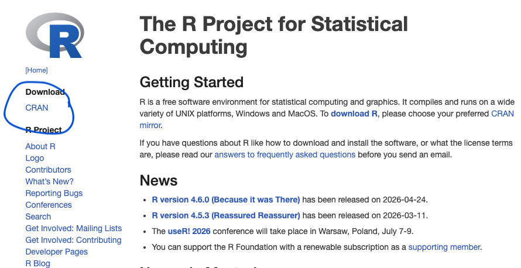{width=90%}


**Step 2.** Choose a mirror close to you. Any US mirror works; Duke University
(Durham, NC) or the Posit mirror are reliable choices.

<!-- FIGURE: Screenshot of the CRAN mirror list with a US mirror highlighted -->
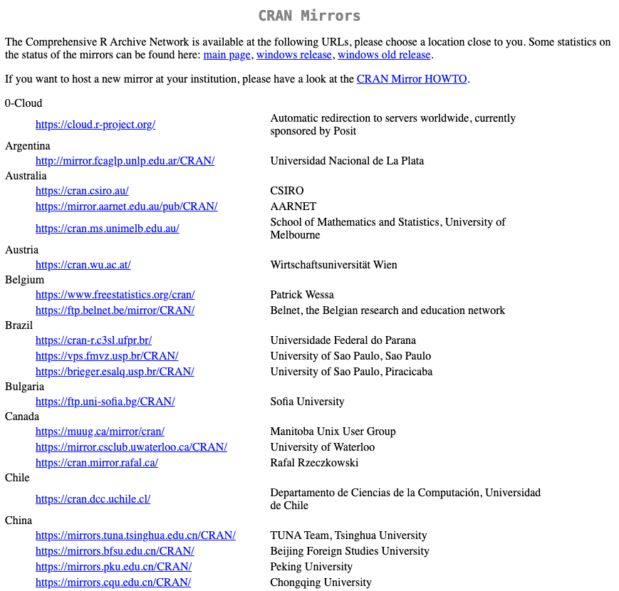{width=90%}

**Step 3 — Windows users:**

- Click **Download R for Windows**
- Click **install R for the first time**
- Click **Download R x.x.x for Windows** (use the current version shown)
- Double-click the downloaded `.exe` and follow the installer: accept all defaults,
  keep the default destination folder, select 64-bit (correct for any modern
  machine), and click **Finish**

<!-- FIGURE: Screenshot of Windows R installer at the first setup dialog -->
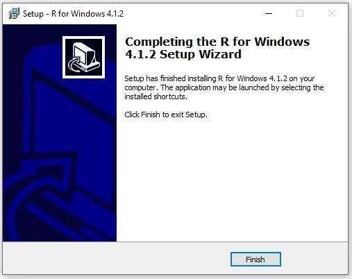{width=90%}

**Step 4 — Mac users:**

- Click **Download R for macOS**
- Which file you need depends on your chip. Check: Apple menu → About This Mac.
  If it says **Apple M1/M2/M3**, download the `arm64` build. If it says
  **Intel**, download the standard build.
- Open the downloaded `.pkg` and click **Continue** through the prompts until
  you see "The installation was successful"

<!-- FIGURE: Screenshot of macOS "About This Mac" showing the chip info -->
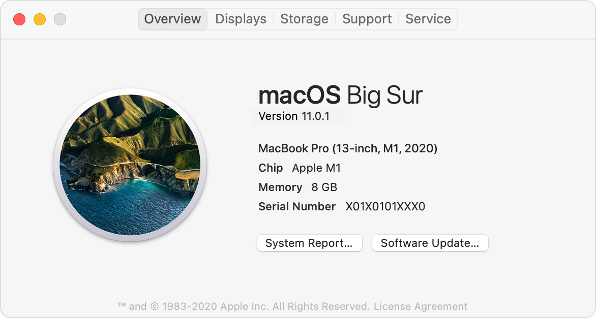{width=90%}

**Testing your R installation.** Open R directly (not RStudio yet) and type:

```r
1 + 1
getwd()
```

You should see `[1] 2` and a file path. If so, R is installed correctly.

<!-- FIGURE: Screenshot of the bare R console showing output of 1+1 and getwd() -->
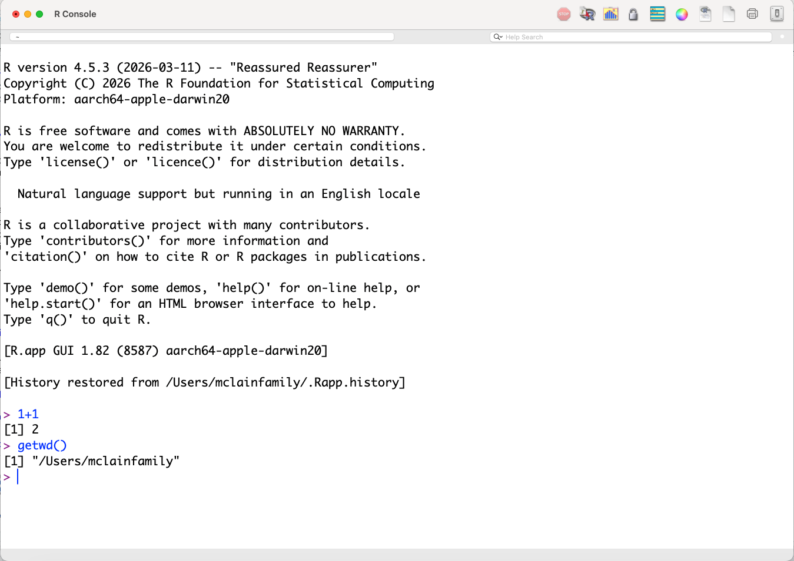{width=90%}

## Installing RStudio

**Step 1.** Go to <https://posit.co/download/rstudio-desktop/> and click
**Install RStudio** (the free version).

<!-- FIGURE: Screenshot of the Posit download page with RStudio Desktop highlighted -->
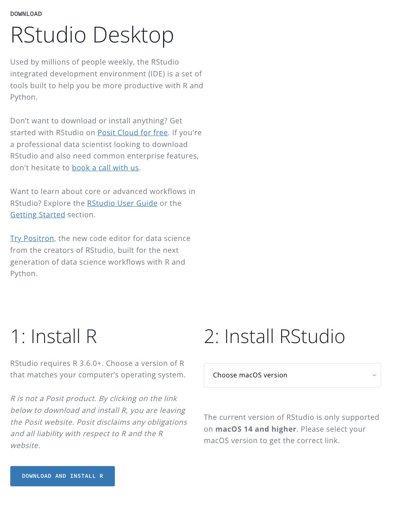{width=90%}

**Step 2 — Windows:** Double-click the downloaded `.exe`, click **Next** through
all prompts, keep the default install location, click **Finish**. To open
RStudio: Start → All Programs → RStudio → RStudio.

**Step 3 — Mac:** Open the downloaded `.dmg` and drag the RStudio icon into your
Applications folder. Open it from Applications or Spotlight search.

::: {.callout-important}
Always open **RStudio**, not bare R. RStudio launches R automatically in the
background. You will do all your work inside RStudio from this point forward.
:::

**Testing your RStudio installation.** Open RStudio and type the following in the
Console pane (bottom-left), pressing Enter after each line:

```r
1 + 1
getwd()
install.packages("tidyverse")
```

The last line will take a few minutes. When it finishes without error, you are
ready to go.

<!-- FIGURE: Screenshot of RStudio Console showing output of the three test commands -->
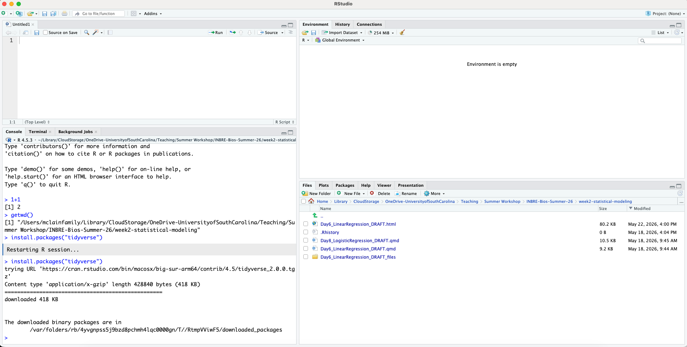{width=90%}

---

# Navigating the RStudio IDE

RStudio has four panes. Here is what each one does:

<!-- FIGURE: Annotated screenshot of RStudio panes -->
{width=90%}


| Pane | Default location | Purpose |
|------|-----------------|---------|
| **Source / Editor** | Top-left | Write and save code (scripts, .qmd files) |
| **Console** | Bottom-left | Where R runs; shows output and errors |
| **Environment / History** | Top-right | Lists objects in memory; command history |
| **Files / Plots / Help** | Bottom-right | File browser, plot viewer, package docs |

## Customizing the Layout

Rearrange panes and adjust appearance under **Tools → Global Options**:

- **Appearance:** Change the editor font, font size, and color theme
- **Pane Layout:** Drag panes to a layout that suits you

<!-- FIGURE: Screenshot of Global Options dialog open to the Pane Layout tab -->
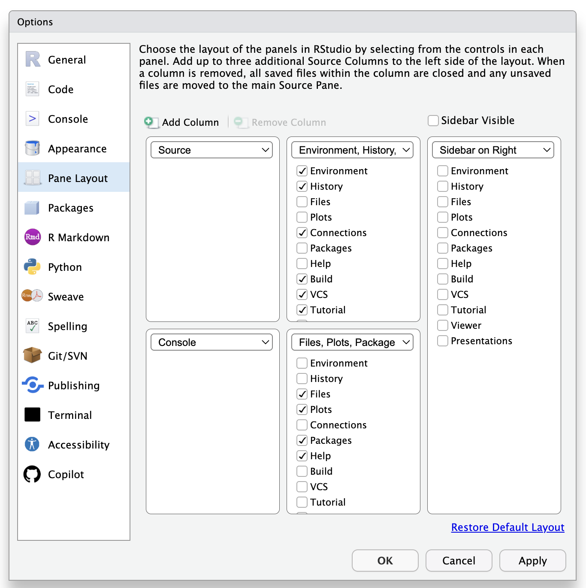{width=90%}

::: {.callout-tip}
**Recommended settings for a long day of coding:** Set your font to
**Consolas** or **Fira Code** at 13--14pt and choose a dark theme such as
"Tomorrow Night Bright" to reduce eye strain.
:::

## Saving and Opening Files

- **Save:** `Ctrl+S` (Windows) / `Cmd+S` (Mac)
- **Open:** File → Open File, or click the folder icon in the editor toolbar

<!-- FIGURE: Screenshot of the editor toolbar with the Save (floppy disk) and
     Open (folder) icons highlighted -->
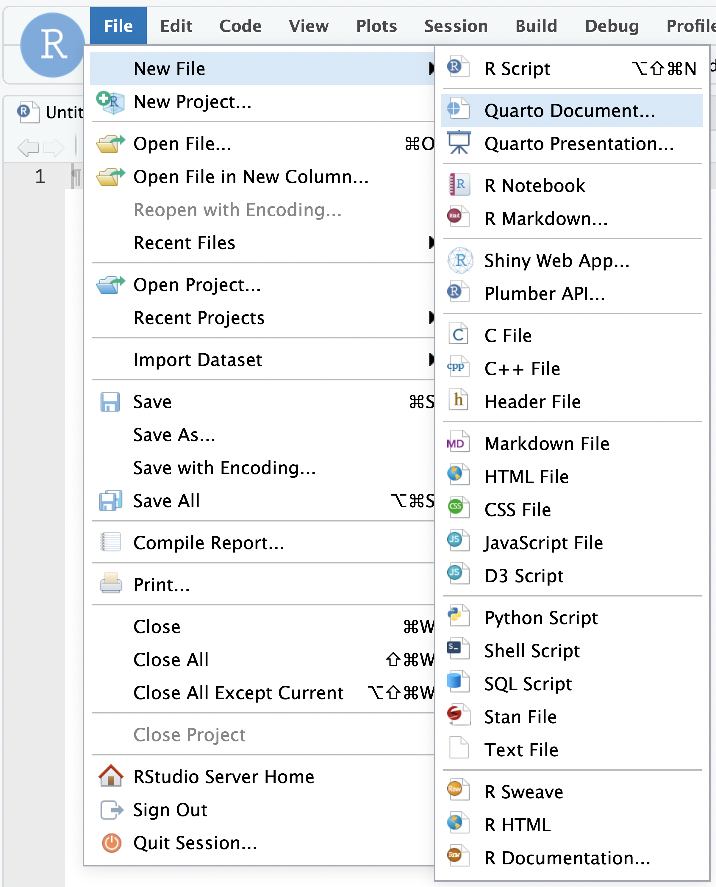{width=90%}

Name your files descriptively with no spaces: use underscores instead
(e.g., `day1_practice.qmd`).

---

# The Console vs. Scripts

## The Console

{width=90%}

The Console (bottom-left) is where R runs code. You can type directly there and
press **Enter** to get an immediate result:

```r
2 + 2
```

The console is useful for quick, exploratory calculations. But anything you type
there is **not saved** --- if you close RStudio, it is gone.

## Scripts

A **script** is a plain text file (`.R` or `.qmd`) that saves your code so you
can run it again, share it, or modify it. Think of the console as a scratch pad
and the script as your lab notebook.


**To open a new R script:** File → New File → R Script (or `Ctrl+Shift+N` /
`Cmd+Shift+N`).

**To run code from a script:**

- Place your cursor on a line and press `Ctrl+Enter` (Windows) or `Cmd+Enter`
  (Mac) to run that line and advance to the next
- Highlight multiple lines and press the same shortcut to run all of them
- Click **Source** to run the entire script at once


::: {.callout-tip}
**A good habit from day one:** Always write your code in a script, not the
console. When something works, you will want to find it again. If it only lives
in the console, it is gone when you close RStudio.
:::

::: {.callout-note}
I use R scripts everyday (the .R type). Whenever I do anything in RStudio it goes into a script. My students are much bigger on creating .qmd files (which we'll do later). To me, .R scripts are things you use when your playing around, and .qmd files are what you use when you are formally showing something. I'm always playing around.
:::

---

# Your First R Code

Open a new script (`Ctrl+Shift+N`) and type along with the examples below.
Run each line with `Ctrl+Enter` / `Cmd+Enter`.

## R as a Calculator

```{r}
1 / 200 * 30
(59 + 73 + 2) / 3
sin(pi / 2)
```

R follows the standard order of operations. Parentheses matter:

```{r}
1/2 + 3       # returns 3.5
1/(2 + 3)     # returns 0.2
3 * 3^3       # exponent applied first: 81
(3 * 3)^3     # parentheses change the result: 729
```


## Creating Objects

Save a result by assigning it to an **object** with `<-`:

```{r}
x <- 3 * 4
x
```

::: {.callout-tip}
**Keyboard shortcut:** `Alt + -` (Windows) or `Option + -` (Mac) types `<-`.
Use it --- you will write this thousands of times.
:::

Object names must start with a letter and can contain only letters, numbers,
`_`, and `.`. We use **snake_case** throughout this course: lowercase words
joined by underscores.

```{r}
#| eval: false
my_result    # recommended: snake_case
myResult     # also common: camelCase
```

R is **case sensitive**: `x` and `X` are different objects.

## Useful Mathematical and Statistical Functions

Base R comes with a large set of built-in functions for math and statistics.
Here are the ones you will use most often:

```{r}
x <- c(4.2, 7.1, 2.8, 9.3, 5.5, 3.6, 8.0, 6.4)

# Central tendency
mean(x)      # arithmetic mean
median(x)    # median

# Spread
var(x)       # variance
sd(x)        # standard deviation
range(x)     # min and max as a vector
diff(range(x)) # range as a single number (max - min)
IQR(x)       # interquartile range

# Sum and cumulative functions
sum(x)       # sum of all elements
cumsum(x)    # cumulative sum
cumprod(x)   # cumulative product

# Order and rank
sort(x)           # sort in ascending order
sort(x, decreasing = TRUE)  # descending
order(x)          # indices that would sort the vector
rank(x)           # rank of each element (average for ties by default)

# Rounding
round(x, digits = 1)   # round to 1 decimal place
floor(x)               # round down to nearest integer
ceiling(x)             # round up to nearest integer
abs(c(-3, 1, -5, 2))   # absolute value

# Common math
sqrt(x)        # square root
log(x)         # natural log
log10(x)       # log base 10
exp(x)         # e^x
```

A few that are especially useful for summarizing data:

```{r}
# Counts and extremes
length(x)   # number of elements
min(x)      # minimum
max(x)      # maximum
which.min(x)  # index of the minimum
which.max(x)  # index of the maximum

# Useful with categorical or logical vectors
table(c("A", "B", "A", "A", "B", "C"))  # frequency count
tabulate(c(1, 2, 1, 3, 2, 1))           # counts by integer value
```

::: {.callout-tip}
Most of these functions have an `na.rm` argument. If your vector contains any
missing values (`NA`), the function will return `NA` by default. Add
`na.rm = TRUE` to ignore them:
:::

```{r}
x_with_missing <- c(4.2, NA, 2.8, 9.3, NA, 3.6)
mean(x_with_missing)              # returns NA
mean(x_with_missing, na.rm = TRUE)  # returns the mean of non-missing values
```


## Comments

R ignores everything after `#` on a line. Use comments freely:

```{r}
# Compute the average of three measurements
measurements <- c(4.2, 5.1, 3.8)
mean(measurements)   # built-in function for the mean
```

::: {.callout-note}
**Best practice:** Comment the *why*, not just the *what*. You can always figure
out what `mean(x)` does. Six months from now you may not remember *why* you were
computing it on that particular variable.
:::

## Vectors

A vector is a sequence of values of the same type. Create one with `c()`:

```{r}
primes <- c(2, 3, 5, 7, 11, 13)
primes
```

Arithmetic on a vector applies to every element:

```{r}
primes * 2
primes - 1
primes^2
```

Three useful ways to generate sequences:

```{r}
1:9                                     # integers 1 through 9
seq(from = 0, to = 1, by = 0.25)       # by step size
seq(from = 0, to = 1, length.out = 6)  # fixed number of points
rep(1:3, times = 3)                     # repeat the whole sequence
rep(1:3, each = 3)                      # repeat each element
```

## A First Data Frame

A **data frame** is the most common way to store rectangular data in R --- like
a spreadsheet. Each column is a vector of the same length.

```{r}
patient_data <- data.frame(
  id     = 1:5,
  age    = c(34, 52, 28, 61, 45),
  weight = c(72.1, 88.4, 65.0, 91.2, 78.5)
)

patient_data
```

Access a single column with `$`:

```{r}
patient_data$age
mean(patient_data$age)
```

Quick summary of the whole data frame:

```{r}
summary(patient_data)
```

---

# Packages

Base R is powerful, but most of what we will do in this course uses **packages**
--- collections of functions contributed by the R community. There are over
20,000 available.

**Install once** (downloads to your machine):

```{r}
#| eval: false
install.packages("tidyverse")
```

**Load at the start of every session** (makes functions available):

```{r}
library(tidyverse)
```

::: {.callout-important}
`install.packages()` and `library()` do different things. Installing downloads
the package; loading activates it. You only install once, but you load every
session.

Also: use straight quotes (`"tidyverse"`), not curly/smart quotes. Smart quotes
will cause an error.
:::

`tidyverse` loads several packages at once:

| Package | Purpose |
|---------|---------|
| `ggplot2` | Data visualization |
| `dplyr` | Data manipulation |
| `tidyr` | Reshaping data |
| `readr` | Reading/writing files |
| `stringr` | Working with text |
| `forcats` | Working with categorical variables |

We will use all of these throughout the course.

---

# Introduction to Quarto

## What Is Quarto?

A **Quarto document** (`.qmd`) combines prose and R code in a single file.
When you **render** it, R runs all the code and produces a polished HTML, PDF,
or Word document with your text, code, and output together.

This is the foundation of **reproducible research**: your analysis and your
write-up live in the same place, and results update automatically if your data
or code changes.

::: {.callout-note}
**R Markdown (`.Rmd`) vs. Quarto (`.qmd`):** Quarto is the successor to R
Markdown. The syntax is nearly identical. If you have seen `.Rmd` files before,
everything you know transfers directly. We use `.qmd` in this course.
:::

## Anatomy of a Quarto Document

**1. YAML header** --- at the very top, between `---` lines. Controls title,
format, and options:

```yaml
---
title: "My Analysis"
format: html
---
```

**2. Prose** written in Markdown:

```markdown
# Heading 1
## Heading 2

Regular paragraph text.

**bold**   *italic*   `inline code`

- bullet item
- another item
```

**3. Code chunks** --- R code between triple backticks:

````markdown
```{{r}}
1 + 1
mean(c(4, 7, 2))
```
````

## Creating and Rendering Your First Document

**Step 1.** File → New File → Quarto Document. Give it a title, keep HTML
selected, click **Create**.

<!-- FIGURE: Screenshot of New Quarto Document dialog with title filled in
     and HTML format selected -->
     
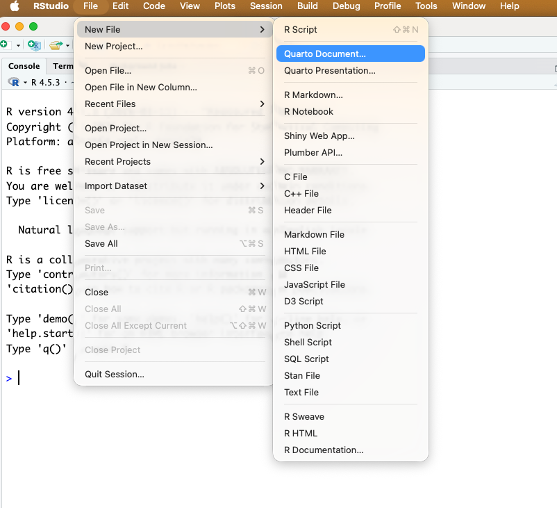{width=90%}
     
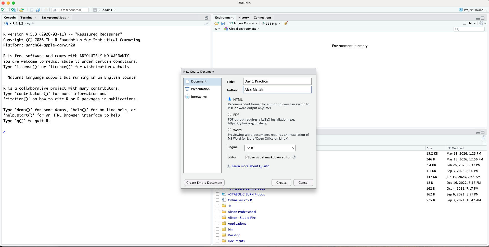{width=90%}

**Step 2.** Click **Render** in the editor toolbar (or `Ctrl+Shift+K` /
`Cmd+Shift+K`). The output opens in your browser or the Viewer pane.


**Step 3.** Try making a change --- edit the title, add a line of prose, change
a number in a code chunk --- then render again.

::: {.callout-note}
On our GitHub (<https://github.com/alexmclain/INBRE-Bios-Summer-26>) page under `week1-foundations/day01-orientation` the file `day1_practice.qmd` should look like what you just created. If you want to see a more complicated example of what Quarto can do, see  `Day1_R_Foundations_1.qmd` (which is this document). It gives you all the code to create everything in this document.
:::


## Key Chunk Options

Control how each chunk behaves with options inside `#|` comments:

```{r}
#| echo: true      # show the code in the output (default)
#| eval: true      # run the code (default)
#| warning: false  # suppress warnings
#| message: false  # suppress messages like package loading notes

2 + 2
```

| Option | Default | Effect |
|--------|---------|--------|
| `echo` | `true` | Show the code in the rendered output |
| `eval` | `true` | Actually run the code |
| `warning` | `true` | Show/hide R warnings |
| `message` | `true` | Show/hide messages (e.g., from `library()`) |

## Inline Code

Embed R results directly in prose:

```markdown
The average age is `r mean(patient_data$age)` years.
```

This renders as a real number in the document and updates automatically if the
data changes.

---

# Exercises

Write your answers in a new `.qmd` document and render it when you are done.

1. Create a vector called `temperatures` with the values 98.6, 99.1, 97.8,
   100.4, 98.2. Compute its mean, standard deviation (`sd()`), and range.

2. Create a data frame called `my_study` with three columns: `subject_id`
   (1 through 6), `treatment` (`"A"` or `"B"`, alternating), and `response`
   (any six numbers). Print it and run `summary()` on it.

3. What happens when you type a name that doesn't exist, like `zebra`? Try it
   in the console and write down what the error message says.

4. In your document, write a sentence using inline code that reports the mean
   of your `temperatures` vector. Render and confirm the number appears
   correctly in the output.

5. Add `echo: false` to one of your code chunks. Render again. What changes?
   What stays the same? When might this option be useful?
